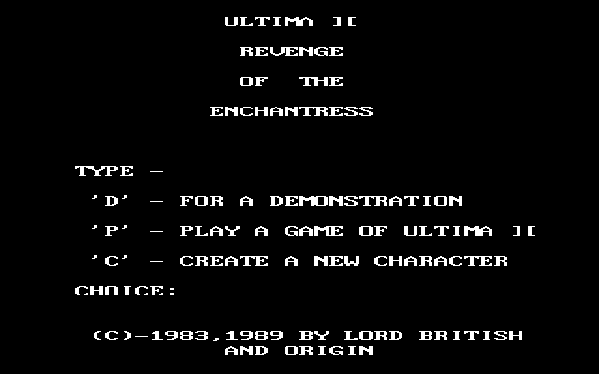

# Ultima II on iOS

**Play Ultima II: The Revenge of the Enchantress on your iPhone or iPad** — the complete,
original DOS game, running in DOSBox, booting straight into the game with an hourglass icon.

It's built on [dospad](https://github.com/litchie/dospad) (the open-source iOS DOSBox,
GPLv2), cloned and patched at build time, plus **your own** copy of Ultima II.

> **You must own Ultima II.** It isn't free, so **no game data is included in this repo** —
> the build copies your own copy onto the device. The DOSBox app is cloned + patched at
> build time, not re-hosted here.

## 📸 Screenshot

The real Ultima II, running in DOSBox — the app boots straight into it:

<p align="center">
  
</p>

## 🚀 Install

Requires a **Mac** with **Xcode** and **git** (no Mac? see [💻 No Mac?](#-no-mac-sideload-the-prebuilt-app) below).

```sh
git clone https://github.com/dmaynard51/ultima2-ios.git
cd ultima2-ios
dosbox/build-ios-dosbox.sh          # Team ID is auto-detected; pass yours to override
```

It clones the iOS DOSBox, patches it to auto-run Ultima II, brands it with the hourglass
icon and the name "Ultima II", builds, signs, installs, and copies your game data onto the
device. First run: **trust the app once** under **Settings ▸ General ▸ VPN & Device
Management**, then reopen — it boots straight into the game.

By default it reads your U2 data from `/Applications/Ultima II™.app/Contents/Resources/game`
(a Mac GOG install — the **[Ultima 1+2+3 bundle](https://www.gog.com/game/ultima_123)**). If
yours is elsewhere, pass the folder (the one with `ULTIMAII.EXE`) as the last argument.

(Find your Team ID: `security find-identity -v -p codesigning` — the code in parentheses.)

> **No paid Apple Developer account ($99/yr) needed.** Installing to your own device
> is free with any Apple ID. The build **strips the extra app-extension** so a free
> "Personal Team" has just one target to sign — the usual cause of the bogus "$99 to
> add a device" wall. If command-line signing still fails (Apple blocks free-account
> CLI signing), the script prints the exact free **Xcode ▸ Run ▶** steps. Note a free
> Apple ID can keep **3 sideloaded apps installed at once** and re-signs every 7 days.

## 💻 No Mac? (sideload the prebuilt app)

No Mac or Xcode? Download the prebuilt **[Ultima II IPA](https://github.com/dmaynard51/ultima2-ios/releases/latest)** and sideload it from a
**Windows or Linux PC** — no Mac needed:

- **[Sideloadly](https://sideloadly.io)** or **[AltStore](https://altstore.io)** install the
  `.ipa` with a **free Apple ID** (AltStore auto-refreshes the 7-day signature over Wi-Fi).
- **No computer at all:** **TrollStore** installs it permanently *if* your iOS supports it;
  in the EU, **AltStore PAL**.

The IPA has **no game data**. After installing, open the **Files** app → **On My iPhone →
Ultima II** and copy your own Ultima II DOS game files into that folder's root, then reopen the
app — it boots straight into the game.

## 🎮 Playing

The app runs in **landscape** with a purpose-built control layout (no fiddly DOS
keyboard or toolbar):

- a **movement D-pad** on the left,
- the frequent **Ultima II commands** as labelled buttons — Attack, Board, Cast, Descend, Enter, Fire, Get, Klimb, Ready, Steal, Talk, Yell,
- a utility row: **⌨** (full keyboard), **Esc**, **↵**, **Pass**, **Yes**, **No**.

The game screen sits above the controls (nothing is covered), and there's **sound**.
When you need to type, tap **⌨** for a full QWERTY, and **⌨▸CMDS** flips back.

## ☕ Support this port

- ☕ **[Buy me a coffee (Ko-fi)](https://ko-fi.com/dmaynard)**
- 💜 **[GitHub Sponsors](https://github.com/sponsors/dmaynard51)**

## 🙏 Credits & license

- iOS DOSBox: **[dospad](https://github.com/litchie/dospad)** by litchie (GPLv2) —
  cloned + patched at build time.
- Hourglass app icon and the build script: MIT — see [LICENSE](LICENSE).
- *Ultima II* and its data are © Origin Systems / Electronic Arts. This project ships
  none of it; you bring your own legally-owned copy.
